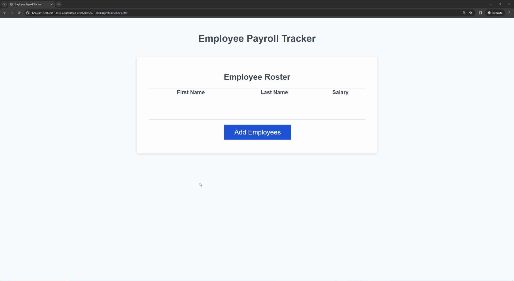

# Java-Script-Challenge
This challenge was done using Java script to list employees first name, last name, and salary. Through the use of Java Script a average salary function and random employee funciton are listed in the console.
